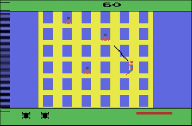

# Projeto Spider man
## FPRO/MIEIC, 2020/21
## Guilherme Magalhães (up202005285)
## 1MIEIC08

### Objetivo

Criar um clone do jogo [Spider Man](https://www.free80sarcade.com/atari2600_SpiderMan.php) da Atari 2600 em Pygame

### Descrição

É um jogo em que o objetivo é acumular pontos (que se conseguem sempre que se toca em inimigos ou se passa um nível). Sempre que se passa um nível, começa-se outro só que um pouco mais difícil

### UI

### Pacotes

- Pygame

### Tarefas
1. [ ] Desenhar um nível
2. [ ] Fazer o spider man disparar teias
3. [ ] Se a teia estiver na diagonal, fazê-lo mexer-se como pêndulo
4. [ ] Permitir ao spider man mover-se para cima e para baixo na teia
5. [ ] Dar pontos sempre que a hitbox do spider man toca na de um inimigo (exceto o goblin, que se deve evitar)
6. [ ] Criar 3 tipos de inimigos: criminosos, bombas e goblin
7. [ ] No final de cada nível, criar um novo, mas um pouco mais difícil
